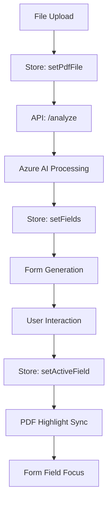

# System Architecture

This document provides a deep dive into the technical architecture of the AI PDF Form Interaction application.

## Overview

The application follows a **layered architecture** with clear separation of concerns:

```
┌─────────────────────────────────────┐
│           Presentation Layer         │ ← React Components, UI, Animations
├─────────────────────────────────────┤
│           Business Logic Layer       │ ← State Management, Form Logic
├─────────────────────────────────────┤
│           Integration Layer          │ ← API Routes, Azure AI Integration
├─────────────────────────────────────┤
│           Data Layer                │ ← File Handling, Validation
└─────────────────────────────────────┘
```

## Component Architecture

### PDF Viewer Module (`components/pdf-viewer/`)

```typescript
PDFDocument (Client Component)
├── react-pdf integration
├── Multi-page rendering
├── Zoom and navigation controls
└── HighlightOverlay[]
    ├── Framer Motion animations
    ├── Click handlers for field selection
    └── Normalized coordinate mapping
```

**Key Responsibilities:**
- PDF rendering with react-pdf
- Page navigation and zoom controls
- Field highlighting with normalized coordinates
- Bidirectional synchronization with form

### Dynamic Form Module (`components/dynamic-form/`)

```typescript
DynamicForm (Client Component)
├── react-hook-form + Zod integration
├── FormHeader (summary and controls)
└── FormFieldRenderer[]
    ├── Type-specific input components
    ├── Validation error display
    └── Focus synchronization
```

**Key Responsibilities:**
- Dynamic form generation from AI-extracted fields
- Real-time validation with Zod schemas
- Type-aware form controls (text, number, checkbox, etc.)
- Bidirectional field synchronization

### Layout Module (`components/layout/`)

```typescript
DashboardLayout (Client Component)
├── Responsive breakpoint detection
├── Mobile: Tabs layout
├── Desktop: Side-by-side panels
├── FileUpload (drag & drop)
├── Header (status and navigation)
└── LoadingSkeleton (placeholder states)
```

**Key Responsibilities:**
- Responsive layout orchestration
- File upload handling
- Loading and error states
- Application navigation

## State Management Architecture

### Zustand Store Pattern

```typescript
interface FormStore {
  // State
  state: {
    pdf: PDFState;
    analysis: AnalysisState;
    ui: UIState;
  };
  
  // Actions  
  actions: {
    setPdfFile: (file: File) => void;
    setFields: (fields: PDFField[]) => void;
    setActiveField: (id: string | null) => void;
  };
}
```

### State Flow Diagram



### Performance Optimizations

1. **Selective Subscriptions**: Components subscribe only to needed state slices
2. **Immutable Updates**: All state changes use immutable patterns  
3. **Debounced Actions**: UI interactions are debounced to prevent excessive updates
4. **Memoized Selectors**: Complex derived state is memoized

## API Integration Architecture

### Server-Only Module (`lib/document-intelligence/`)

```typescript
// document-intelligence.ts
export async function analyzeDocument(buffer: ArrayBuffer): Promise<AnalysisResult>

Flow:
1. Convert file to base64
2. Call Azure AI Document Intelligence API
3. Poll for completion (async processing)
4. Transform polygon coordinates to normalized rectangles
5. Infer field types from content analysis
6. Validate response with Zod schemas
```

### API Route (`app/api/analyze/route.ts`)

```typescript
POST /api/analyze
├── File validation (type, size, content)
├── Rate limiting and error handling
├── Azure service integration
├── Response transformation
└── Structured error responses
```

**Security Measures:**
- API keys kept server-side only
- Input validation and sanitization
- Structured error handling (no sensitive info leakage)
- File type and size restrictions

## Data Flow Architecture

### Coordinate Transformation Pipeline

```typescript
Azure Polygon → Normalized Rectangle → CSS Positioning

1. Azure returns 8-point polygon coordinates
2. Convert to bounding rectangle (min/max x,y)
3. Normalize to 0-1 scale using page dimensions  
4. Apply to CSS for resolution-independent positioning
```

### Field Type Inference

```typescript
AI Detected Content → Type Analysis → Form Control Selection

1. Azure extracts text content from fields
2. Pattern matching for emails, numbers, dates
3. Content analysis for checkboxes and selections
4. Default to text input for unknown patterns
```

## Animation Architecture

### Centralized Animation System (`lib/animations/`)

```typescript
Animation Categories:
├── Page Transitions (state changes)
├── Layout Animations (responsive)  
├── Micro-interactions (buttons, hovers)
├── Loading States (skeletons, progress)
└── Error States (shakes, highlights)

Configuration:
├── Easing curves (standard, emphasized, decelerated)
├── Duration tokens (fast, normal, slow)
├── Reusable variants (fieldFocus, cardHover)
└── Accessibility (reduced motion support)
```

### Performance Considerations

1. **GPU Acceleration**: Transform and opacity changes only
2. **Selective Triggers**: Animations only when beneficial to UX
3. **Reduced Motion**: Respect user accessibility preferences
4. **Cleanup**: Proper animation cleanup to prevent memory leaks

## Build Architecture

### Next.js Configuration (`next.config.ts`)

```typescript
Configuration Highlights:
├── Turbopack (Next.js 16 default)
├── Canvas aliasing for PDF.js compatibility
├── External packages for Azure SDK
└── Production optimizations
```

### TypeScript Configuration

```typescript
Strict Mode Enabled:
├── Strict null checks
├── No implicit any
├── Unused locals detection
└── Import/export validation
```

## Security Architecture

### Defense in Depth

1. **Client-Side**:
   - Input validation (file type, size)
   - Content Security Policy headers
   - XSS protection via React

2. **Server-Side**:
   - API key isolation
   - Request validation
   - Rate limiting
   - Structured error responses

3. **Infrastructure**:
   - Environment variable security
   - HTTPS enforcement
   - Secure headers configuration

## Scalability Considerations

### Performance Scaling

1. **Client-Side Caching**: PDF and analysis results cached in browser
2. **Optimistic UI**: Immediate feedback for user actions
3. **Progressive Loading**: Critical content loads first
4. **Code Splitting**: Dynamic imports for non-critical features

### Infrastructure Scaling

1. **Stateless Design**: No server-side sessions or state
2. **CDN Compatible**: Static assets can be cached globally
3. **Horizontal Scaling**: API routes can scale independently
4. **Database Ready**: Architecture supports adding persistence layer

## Monitoring & Observability

### Error Tracking

```typescript
Error Categories:
├── Client Errors (component failures, validation)
├── API Errors (service failures, timeouts)
├── AI Service Errors (analysis failures, quality issues)
└── Network Errors (connectivity, timeouts)
```

### Performance Metrics

```typescript
Key Metrics:
├── Time to First Paint (TFP)
├── Largest Contentful Paint (LCP)
├── First Input Delay (FID)
├── Cumulative Layout Shift (CLS)
└── PDF Load Time
```

## Testing Architecture

### Testing Strategy (Future Enhancement)

```typescript
Testing Pyramid:
├── Unit Tests (components, utilities, validation)
├── Integration Tests (API routes, state management)
├── E2E Tests (user workflows, PDF interaction)
└── Visual Regression Tests (UI consistency)

Tools:
├── Jest + React Testing Library (unit)
├── Playwright (E2E)
├── Axe (accessibility)
└── Chromatic (visual regression)
```

## Deployment Architecture

### Vercel Deployment

```typescript
Configuration:
├── Edge Functions (API routes)
├── Static Site Generation (pages)
├── Environment Variables (Azure keys)
└── Performance Monitoring
```

### Docker Support

```typescript
Multi-stage Build:
├── Dependencies installation
├── Application build
├── Production image creation
└── Runtime optimization
```

This architecture provides a solid foundation for scaling the application while maintaining code quality, security, and performance.